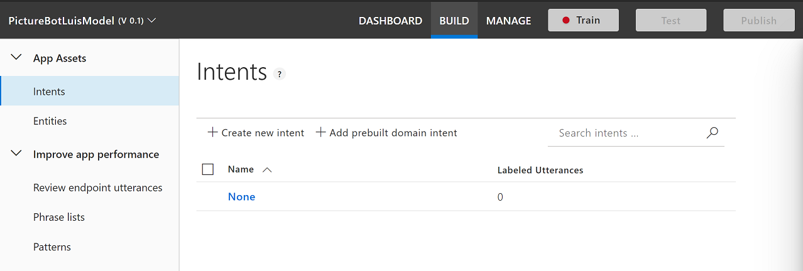
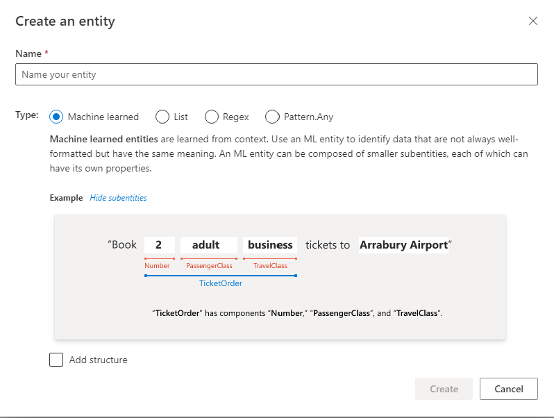
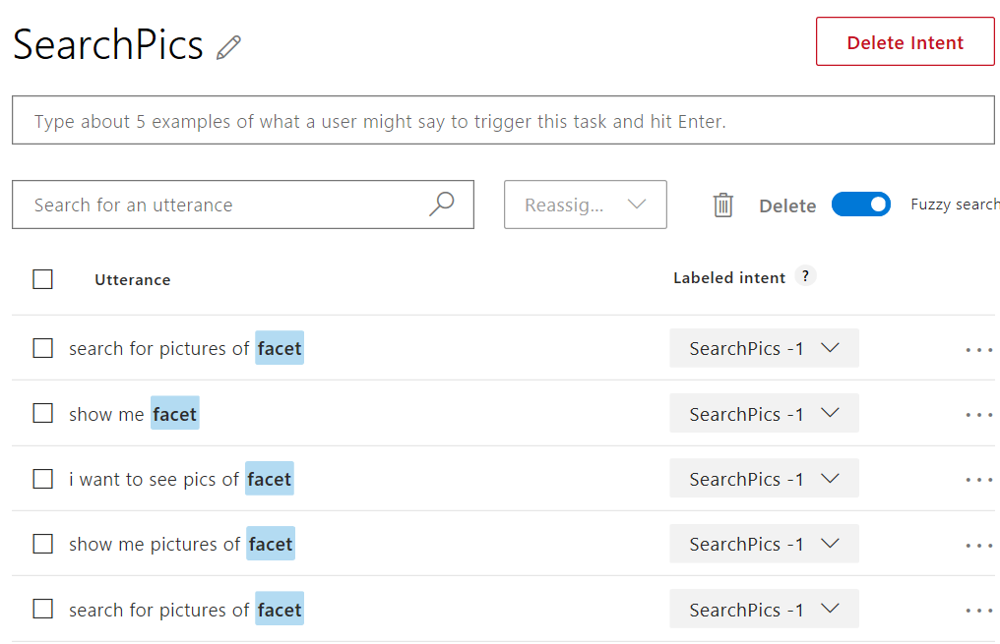

# Lab 6: Implementing the LUIS model

This hands-on lab guides you through creating a model to enhance the Natural Language Processing capabilities of your applications, using Microsoft's Language Understanding Intelligent Service (LUIS).

## Introduction

In this lab, you will build, train and publish a LUIS model to help your bot (which will be created in a future lab) communicate effectively with human users.

> **Note** In this lab, we will only be creating the LUIS model that you will use in a future lab to build a more intelligent bot.

The LUIS functionality and functionality has already been covered in the workshop; for a refresher on LUIS, [read more](https://docs.microsoft.com/en-us/azure/cognitive-services/LUIS/Home).

Now that we know what LUIS is, we'll want to plan our LUIS app. We already created a basic bot ("PictureBot") that responds to messages containing certain text. We will need to create intents that trigger the different actions that our bot can do, and create entities that require different actions. For example, an intent for our PictureBot may be "OrderPic" and it triggers the bot to provide an appropriate response.

For example, in the case of Search (not implemented here), our PictureBot intent may be "SearchPic" and it triggers Azure Cognitive Search service to look for photos, which requires a "facet" entity to know what to search for.  You can see more examples for planning your app [here](https://docs.microsoft.com/en-us/azure/cognitive-services/LUIS/plan-your-app).

Once we've thought out our app, we are ready to [build and train it](https://docs.microsoft.com/en-us/azure/cognitive-services/LUIS/luis-get-started-create-app).

As a review, these are the steps you will generally take when creating LUIS applications:

  1. [Add intents](https://docs.microsoft.com/en-us/azure/cognitive-services/LUIS/add-intents)
  2. [Add utterances](https://docs.microsoft.com/en-us/azure/cognitive-services/LUIS/add-example-utterances)
  3. [Add entities](https://docs.microsoft.com/en-us/azure/cognitive-services/LUIS/add-entities)
  4. [Improve performance using phrase lists](https://docs.microsoft.com/en-us/azure/cognitive-services/LUIS/add-features) and [patterns](https://docs.microsoft.com/en-us/azure/cognitive-services/LUIS/luis-how-to-model-intent-pattern)
  5. [Train and test](https://docs.microsoft.com/en-us/azure/cognitive-services/LUIS/train-test)
  6. [Review endpoint utterances](https://docs.microsoft.com/en-us/azure/cognitive-services/LUIS/label-suggested-utterances)
  7. [Publish](https://docs.microsoft.com/en-us/azure/cognitive-services/LUIS/publishapp)

## Lab 6.0: Creating the LUIS service in the portal (optional)

Creating a LUIS service in the portal is optional, as LUIS provides you with a "starter key" that you can use for the labs. However, if you want to see how to create a free or paid service in the portal, you can follow the steps below.  

> **Note** If you ran the pre-req ARM Template, you will already have a cognitive services resource that included the Language Understanding APIs.

1. Open the [Azure Portal](https://portal.azure.com)

1. Select **Create a resource**

1. Enter **Language Understanding** in the search box and choose **Language Understanding**

1. Select **Create**

1. For the name, type **{YOURINIT}luisbot**

1. Select your subscription and and location similar to your resource group

1. For the pricing tier, select **F0**

1. Select your resources group

1. For the runtime location, select a location similar to your resource group

1. For the runtime pricing, select **F0**

1. Select **Create**

**Note** The Luis AI web site does not allow you to control or publish your Azure based cognitive services resources.  You will need to call the APIs in order to train and publish them.

## Lab 6.1: Adding intelligence to your applications with LUIS

Let's look at how we can use LUIS to add some natural language capabilities. LUIS allows you to map natural language utterances (words/phrases/sentences the user might say when talking to the bot) to intents (tasks or actions the user wants to perform). For our application, we might have several intents: finding pictures, sharing pictures, and ordering prints of pictures, for example. We can give a few example utterances as ways to ask for each of these things, and LUIS will map additional new utterances to each intent based on what it has learned.

> **Warning**: Though Azure services use IE as the default browser, we do not recommend it for LUIS. You should be able to use Chrome or Firefox for all of the labs. Alternatively, you can download either [Microsoft Edge](https://www.microsoft.com/en-us/download/details.aspx?id=48126) or [Google Chrome](https://www.google.com/intl/en/chrome/).

1. Navigate to [https://www.luis.ai](https://www.luis.ai) (**unless you are located in Europe or Australia***). We will create a new LUIS app to support our bot.

> **Note** If you created a key in a **Europe** region, you will need to create your application at [https://eu.luis.ai/](https://eu.luis.ai/). If you created a key in an **Australia** region, you will need to create your application at [https://au.luis.ai/](https://au.luis.ai/). You can read more about the LUIS publishing regions [here](https://docs.microsoft.com/en-us/azure/cognitive-services/luis/luis-reference-regions).

1. Sign in using your Organization or Microsoft account. This should be the same account that you used to create the LUIS key in the previous section.

1. Select **Create a LUIS app now**. You should be redirected to a list of your LUIS applications.  If prompted, select **Migrate Later**.  

1. If this is your first time, you will be asked to agree with service terms of use and select your county.

- On next step you need to chose recommended option and link your Azure account with LUIS.
- Finally confirm your settings and you will be forwarded to the LUIS App page.

> **Note**: Notice that there is also an "Import App" next to the "New App" button on [the current page](https://www.luis.ai/applications).  After creating your LUIS application, you have the ability to export the entire app as JSON and check it into source control.  This is a recommended best practice, so you can version your LUIS models as you version your code.  An exported LUIS app may be re-imported using that "Import App" button.  If you fall behind during the lab and want to cheat, you can select the "Import App" button and import the [LUIS model](./code/LUIS/PictureBotLuisModel.json).

1. From the main page, select the **Create new app** button

1. Type a name, and select **Done**.  Close the "How to create an effective LUIS app" dialog.

1. In the top navigation, select the **BUILD** link.  Notice there is one intent called "None".  Random utterances that don't map to any of your intents may be mapped to "None".

We want our bot to be able to do the following things:

- Search/find pictures
- Share pictures on social media
- Order prints of pictures
- Greet the user (although this can also be done other ways, as we will see later)

Let's create intents for the user requesting each of these.  

1. Select the **Create new intent** button.

1. Name the first intent **Greeting** and select **Done**.  

1. Give several examples of things the user might say when greeting the bot, pressing "Enter" after each one.

Let's see how to create an entity.  When the user requests to search the pictures, they may specify what they are looking for.  Let's capture that in an entity.

1. Select on **Entities** in the left-hand column and then select **+ Create**.  

1. Give it an entity name **facet**

1. For the entity type select **Machine learned**.  

1. Select **Create**.

1. Select **Intents** in the left-hand sidebar and then click the **Create new intent** button.  

1. Give it an intent name of **SearchPic** and then click **Done**.

Just as we did for Greetings, let's add some sample utterances (words/phrases/sentences the user might say when talking to the bot).  People might search for pictures in many ways.  Feel free to use some of the utterances below, and add your own wording for how you would ask a bot to search for pictures.

- Find outdoor pics
- Are there pictures of a train?
- Find pictures of food.
- Search for photos of kids playing
- Show me beach pics
- Find dog photos
- Show me pictures of men wearing glasses
- Show me happy baby pics

Once we have some utterances, we have to teach LUIS how to pick out the **search topic** as the "facet" entity. Whatever the "facet" entity picks up is what will be searched.

1. Hover and click the word (or click consecutive words to select a group of words) and then select the "facet" entity.

So your utterances may become something like this when facets are labeled:

>**Note** This workshop does not include Azure Cognitive Search, however, this functionality has been left in for the sake of demonstration.

1. Select **Intents** in the left sidebar and add two more intents:

- Name one intent **"SharePic"**.  This might be identified by utterances like:

  - Share this pic
  - Can you tweet that?
  - Post to Twitter

- Create another intent named **"OrderPic"**.  This could be communicated with utterances like:

  - Print this picture
  - I would like to order prints
  - Can I get an 8x10 of that one
  - Order wallets

When choosing utterances, it can be helpful to use a combination of questions, commands, and "I would like to..." formats.

1. Finally add some sample utterances to the "None" intent. This helps LUIS label when things are outside the scope of your application. Add things like "I'm hungry for pizza", "Search videos", etc. You should have about 10-15% of your app's utterances within the None intent.

## Lab 6.2: Training the LUIS model

We're now ready to train our model. In this exercise, you will perform a simple training operation in order to test your model.  The testing will take place using the built-in testing panel in the LUIS portal.

1. In the top toolbar, select **Train**. During training, LUIS builds a model to map utterances to intents based on the training data you’ve provided.

    > [!TIP]
    > Training is not always immediate. Sometimes it gets queued and can take several minutes.

## Create a public endpoint for the LUIS service

1. After training is finished, select **Manage** in the top toolbar. The following options will appear on the left toolbar:

    > [!NOTE]
    > The categories on the left pane may change as the portals are updated.  As a result, the keys and endpoints may fall under a different category than the one listed here.

    - **Publish settings**
    - **Azure Resources**
    - **Versions**
    - **Collaborators**

1. Select **Azure Resources**. This screen is used to manage the URL endpoints used to access the LUIS service.

    > [!NOTE]
    > An endpoint named **Starter_Key** is automatically created for testing purposes, and you could use that here - however to use the service in a production environment or inside of an application, you will always want to tie it to a real Language Understanding resource created in Azure.

1. You should see a **Prediction Resource** and a **Starter_Key** resource already created.  If you see the **Prediction Resource**, advance to the next section on **Publish the app**.
1. If you do not see an existing **Prediction Resource**, select **Add prediction resource**. The **Tenant** will already be selected.
1. Select your subscription, and the resource you created in the Azure portal earlier and then select **Done** to connect the Language Understanding resource to the LUIS service.

## Publish the app

1. In the top toolbar, select **Publish**.

   > [!NOTE]
   > You can publish to your **Production** or **Staging** endpoint. Select **Production**, and read about the reasons for the two endpoints.

1. Under **Choose your publishing slot and settings**, select **Production Slot** and then select **Done**.

    Publishing creates an endpoint to call the LUIS model. The endpoint URL will be displayed. Copy the endpoint URL and add it to your list of keys for future use.

1. In the top bar, select **Test**. Try typing a few utterances and see which intents are returned. Here are some examples you can try:

   | Utterance | Result | Score meaning |
   |---------|---------|---------|
   | **Show me pictures of a local beach** | Returns the **SearchPic** intent with a score | Positive match |
   | **Hello** | Returns the **Greeting** intent with a score | Fairly positive match |
   | **Send to Tom** | Returns the **Utilities** with a low score | Needs retraining or doesn't match any intents |

To retrain the model for utterances with low scores, take the following steps:

1. Beside the low-scoring utterance (in this case, **Send to Tom**), select **Inspect**.
1. Beside **Top-scoring intent**, select the drop-down and choose **SharePic** from the list.
1. Close the **Test** panel.
1. Select the **Train** button to retrain your model.
1. Test the **Send to Tom** utterance again. It should now return the **SharePic** intent with a higher score.

Your LUIS app is now ready to be used by client applications, tested in a browser through the listed endpoint, or integrated into a bot.

You can also [test your published endpoint in a browser](https://docs.microsoft.com/en-us/azure/cognitive-services/LUIS/PublishApp#test-your-published-endpoint-in-a-browser). Copy the Endpoint URL. To open this URL in your browser, set the URL parameter `&q=` to your test query. For example, append `Find pictures of dogs` to your URL, and then press Enter. The browser displays the JSON response of your HTTP endpoint.

## Going further

If you still have time, spend time exploring the www.luis.ai site. Select "Prebuilt domains" and see [what is already available for you](https://docs.microsoft.com/en-us/azure/cognitive-services/luis/luis-reference-prebuilt-domains). You can also review some of the [other features](https://docs.microsoft.com/en-us/azure/cognitive-services/luis/luis-concept-feature) and [patterns](https://docs.microsoft.com/en-us/azure/cognitive-services/luis/luis-concept-patterns)
, and check out the [BotBuilder-tools](https://github.com/Microsoft/botbuilder-tools) for creating LUIS models, managing LUIS models, simulating conversations, and more. Later, you may also be interested in [another course that includes how to design LUIS schema](https://aka.ms/daaia).

## Extra Credit

If you wish to attempt to create a LUIS model including Azure Cognitive Search, follow the training on [LUIS models including search](https://github.com/Azure/LearnAI-Bootcamp/tree/master/lab01.5-luis).

## Next Steps

- [Lab 07-01: Integrate LUIS](../Lab7-Integrate_LUIS/01-Introduction.md)
